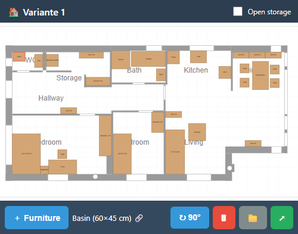

# Quick & Dirty Floor Planner

A no-signup, no-account floor planner that runs entirely in your browser.
Built in an afternoon because my mother was in hospital and wanted to rearrange
furniture in her storage room from her phone.

**👉 [Try it](https://fliegenf4nger.github.io/quick-dirty-floorplanner/)**

## Why

Every existing floor planner assumes you want to design your dream apartment
from scratch — 3D views, accounts, subscriptions, tutorials. The much more
common case is the opposite: you already have a floor plan, and you just want
to *move furniture around on it* — for a move, a renovation, accessibility
adjustments in a relative's home, an office layout, a dorm room.

This is the tool for that case. One HTML file. No backend. No tracking.
Pinch-zoom on a phone. Share a layout via a link. That's it.

## Features

- **Mobile-first.** Designed for one-handed use on a phone in a hospital bed.
- **Pan & pinch-zoom**, drag furniture with your finger, rotate in 90° steps.
- **Magnetic snap** to walls and other furniture.
- **Furniture catalogue** with realistic dimensions (beds, wardrobes, sofas,
  kitchen, bathroom…) plus a free-form custom-size option.
- **Multiple named variants** — try out different layouts side by side.
- **Share via link** — the entire variant is encoded in the URL hash. Send it
  via WhatsApp, the recipient opens it, edits, and sends a new link back.
  No server, no account.
- **Auto-save** to `localStorage`.
- **Bilingual UI** (English / German). Auto-detects browser language, override
  with `?lang=de` or `?lang=en`.

## Status

**Alpha.** It works, it's useful, but it's deliberately tiny and rough. The
demo floor plan is currently hard-coded; an image-based plan import is on the
roadmap (the algorithm already works in Python, just needs porting to JS).

## Roadmap

- [ ] Floor plan import: upload a photo/PDF of an existing plan, auto-trace walls
- [ ] Wall editing: draw and move walls directly in the app
- [ ] Export as bitmap / PDF for printing
- [ ] Furniture rotation in arbitrary angles (currently 90° only)
- [ ] Undo / redo
- [ ] More furniture, optionally branded (IKEA Pax, etc.)
- [ ] Accessibility helpers: wheelchair turning radius, reach zones

## Run locally

It's a single HTML file. Open `index.html` in a browser. That's the entire
build process.

## Contributing

PRs welcome. The code is intentionally vanilla JavaScript with no build step
or dependencies — to keep it readable and to make sure the entire app stays
deployable as a single static file.

## License

MIT — see [LICENSE](LICENSE).

---

*Vibe-coded with [Claude](https://claude.com/claude-code) (Anthropic) in a
single afternoon. The conversation that produced this tool — including the
floor-plan tracing from a hand-drawn sketch — is itself part of the story.*
